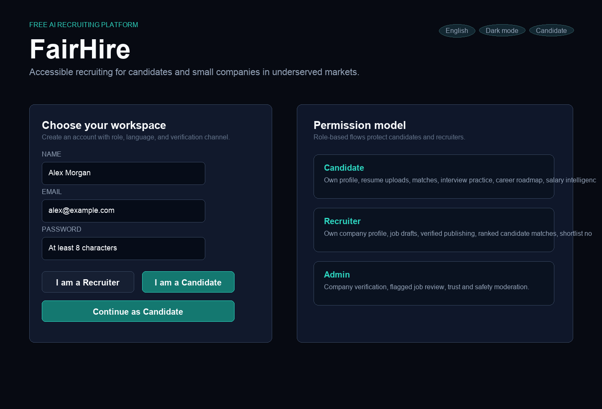
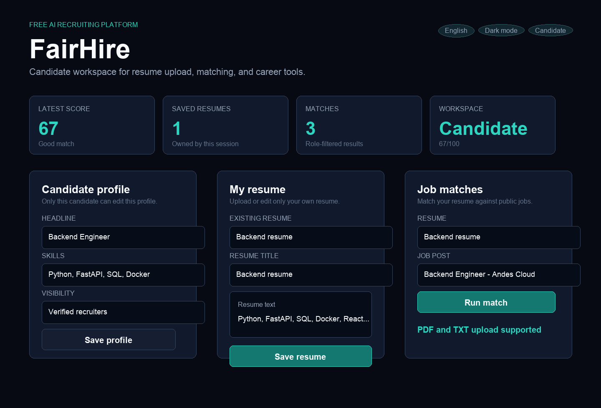
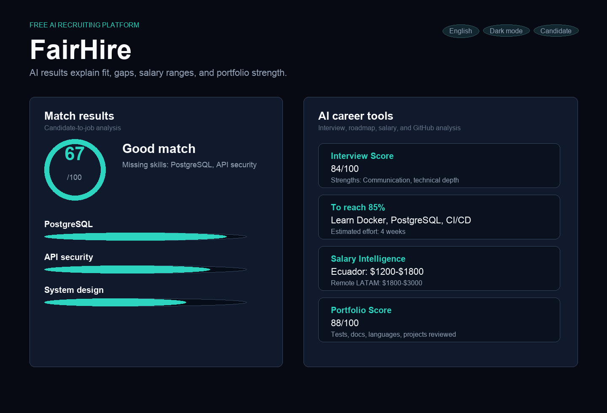
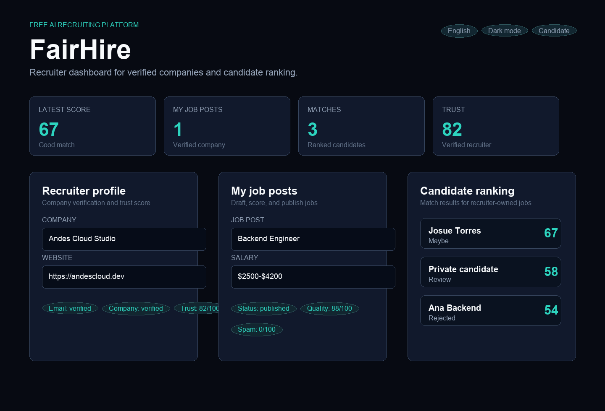

# FairHire

A free AI-powered recruiting platform for candidates and small companies in underserved markets.

Hiring tools are expensive. This project aims to make AI-powered recruiting accessible to candidates, small businesses, and communities that cannot afford enterprise recruiting software.

## Overview

FairHire is a full-stack recruiting SaaS portfolio project built around trust, accessibility, and practical AI workflows. Candidates can upload resumes, match against jobs, practice interviews, analyze salary ranges, and review their GitHub portfolio. Recruiters can create verified company profiles, publish safer job posts, review ranked candidates, and manage shortlists.

The project is intentionally designed as a serious open-source product foundation: role-based permissions, backend tests, SQLite persistence, multilingual UI, AI fallback logic, and GitHub Actions-ready structure.

## Screenshots

### Home



### Resume Upload



### AI Results



### Recruiter Dashboard



## Features

- Candidate and recruiter account creation with password-based mock auth
- English and Spanish UI support
- User language preference stored in the backend
- AI/fallback responses generated in the selected language
- PDF and TXT resume upload
- Resume-to-job match score from 0-100
- Missing skills and resume improvement suggestions
- AI Interview Simulator for backend engineering practice
- AI Career Coach with target score, learning gaps, effort estimate, and roadmap
- Salary Intelligence for Ecuador, Remote LATAM, and US contractor markets
- GitHub Portfolio Analysis with portfolio score, languages, projects, tests, docs, and recommendations
- Recruiter dashboard with job posts, match counts, average match score, and shortlisted candidates
- Company verification workflow
- Email validation and verification placeholder for email, SMS, or WhatsApp
- Job spam scoring and quality scoring
- Candidate privacy controls
- Suspicious job reporting
- Admin routes for company review and flagged job moderation
- Low-bandwidth preference
- Backend tests for permissions, trust rules, and AI tools

## Tech Stack

| Layer | Technology |
| --- | --- |
| Frontend | Next.js, React, TypeScript |
| Backend | FastAPI, Python |
| Database | SQLite, SQLAlchemy |
| AI | OpenAI API integration with local heuristic fallback |
| Testing | Pytest, Node test runner |
| DevOps | Docker files, GitHub Actions |
| Resume parsing | PDF and UTF-8 TXT extraction |

## Architecture

```text
FairHire
  frontend/
    Next.js app
    TypeScript API client
    Candidate and recruiter dashboards
  backend/
    FastAPI routes
    SQLAlchemy models
    SQLite persistence
    AI analysis, trust scoring, security validation
  docs/
    images/
      home.png
      upload.png
      results.png
      dashboard.png
```

Core backend tables:

- `users`
- `candidates`
- `recruiters`
- `resumes`
- `job_posts`
- `analyses`
- `job_reports`

Authorization model:

- Candidates can edit only their own profile and resumes.
- Recruiters can edit only their own company profile and job posts.
- Recruiters cannot edit candidate profiles, resumes, or personal data.
- Candidates cannot edit recruiter job posts or company profiles.
- Recruiters cannot publish jobs without verified account and verified company status.
- Admin-only review routes are protected.

## Installation

Clone the project:

```bash
git clone https://github.com/josuetorresf2/ai-resume-job-matcher.git
cd ai-resume-job-matcher
```

Create environment file:

```bash
cp .env.example .env
```

Add your OpenAI API key if you want live AI responses:

```bash
OPENAI_API_KEY=sk-your-key
```

The app still works without an API key by using local heuristic analysis.

## Running Locally

Backend:

```bash
cd backend
python3 -m venv .venv
source .venv/bin/activate
pip install -r requirements.txt
uvicorn app.main:app --reload
```

Frontend:

```bash
cd frontend
npm install
npm run dev
```

Open:

- Frontend: http://localhost:3000
- Backend API docs: http://localhost:8000/docs

## Usage Examples

Create a candidate account:

1. Open FairHire.
2. Select `I am a Candidate`.
3. Enter name, email, password, language, and verification channel.
4. Upload or paste a resume.
5. Run a match against a published job.
6. Use AI Interview Simulator, Career Coach, Salary Intelligence, and GitHub Analysis.

Create a recruiter account:

1. Select `I am a Recruiter`.
2. Create a company profile.
3. Verify the account with the placeholder flow.
4. Wait for admin company approval.
5. Create a job post draft.
6. Review job quality and spam score.
7. Publish and review ranked candidate matches.

Run tests:

```bash
cd backend
pytest
```

```bash
cd frontend
npm test
npm run build
```

## API Highlights

```http
POST /auth/mock-login
POST /resumes
POST /matches
POST /candidate/interview-practice
POST /candidate/career-coach
POST /candidate/salary-intelligence
POST /candidate/github-analysis
POST /job-posts
POST /job-posts/{job_post_id}/publish
GET  /recruiter/dashboard
GET  /job-posts/{job_post_id}/ranked-candidates
PUT  /admin/companies/{recruiter_user_id}/review
```

## Roadmap

- Real authentication with secure password hashing and session tokens
- Production email, SMS, or WhatsApp verification provider
- Admin review UI
- Fraud detection for fake companies, fake candidates, AI-generated nonsense resumes, and copy-paste job descriptions
- Recruiter Copilot for job descriptions, responsibilities, salary recommendations, and interview questions
- One-click resume builder with ATS-friendly PDF export and LinkedIn summary
- AI job search agent that finds, ranks, and explains job opportunities
- Video introduction analysis for clarity, confidence, and speaking pace
- Referral network for community-supported referrals
- University mode for students without experience or portfolio
- Opportunity Score for salary transparency, company reputation, growth, and remote flexibility
- Deployment guide and live demo

## License

MIT License. See [LICENSE](LICENSE).
