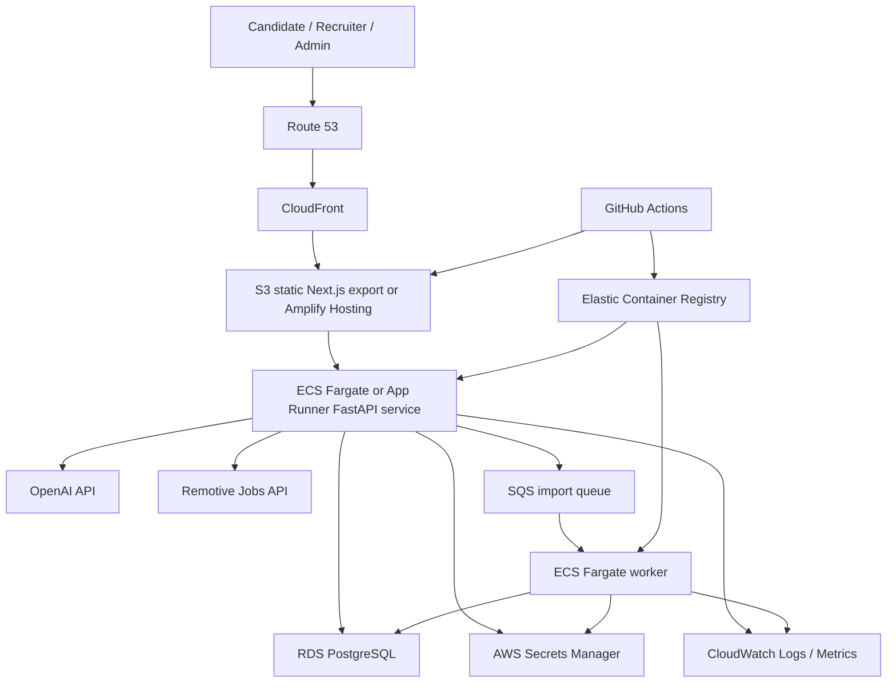

# FairHire AWS-Ready Deployment Architecture

This document describes a production AWS architecture for FairHire without requiring AWS credentials or account-specific resources in this repository.

## Architecture

## Services

- Frontend: S3 + CloudFront for static hosting, or AWS Amplify Hosting for managed Next.js deployment.
- Backend API: ECS Fargate or App Runner running the existing FastAPI Docker image.
- Worker: separate ECS Fargate service for long-running job imports and future Temporal activities.
- Database: RDS PostgreSQL with automated backups.
- Secrets: AWS Secrets Manager for `DATABASE_URL`, `AUTH_SECRET_KEY`, `OPENAI_API_KEY`, Twilio credentials, and provider-specific API settings.
- Logs and metrics: CloudWatch logs for API/worker containers, plus alarms for 5xx rate, task restarts, and database CPU/storage.
- CI/CD: GitHub Actions builds images, pushes to ECR, runs migrations, and deploys frontend/backend.

## Networking

- Public traffic reaches CloudFront over HTTPS.
- API runs behind an Application Load Balancer or App Runner managed HTTPS endpoint.
- RDS stays in private subnets and accepts traffic only from API/worker security groups.
- Secrets are read by task roles, not stored in images or committed files.
- Outbound API calls are limited to required providers such as OpenAI and Remotive.

## Deployment Flow

1. GitHub Actions runs backend tests, frontend tests, linting, type checks, and builds.
2. Backend image is built from `backend/Dockerfile` and pushed to ECR.
3. Frontend build is deployed to S3/CloudFront or Amplify.
4. Database migrations run as a one-off ECS task before the new API task set receives traffic.
5. ECS/App Runner deploys the API service.
6. Worker service deploys separately so import jobs do not block API startup.

## Secrets

Required production secrets:

- `DATABASE_URL`
- `AUTH_SECRET_KEY`
- `OPENAI_API_KEY`
- `OPENAI_MODEL`
- `CORS_ORIGINS`
- `TWILIO_ACCOUNT_SID`
- `TWILIO_AUTH_TOKEN`
- `TWILIO_SMS_FROM`
- `TWILIO_WHATSAPP_FROM`
- `WHATSAPP_CLOUD_ACCESS_TOKEN`
- `WHATSAPP_CLOUD_PHONE_NUMBER_ID`
- `WHATSAPP_CLOUD_API_VERSION`

Never commit real values. Store them in AWS Secrets Manager and GitHub Actions environment secrets.

## Cost Controls

- Start with App Runner or one small ECS Fargate API task.
- Use a small RDS PostgreSQL instance during portfolio/demo usage.
- Set CloudWatch log retention to 7-14 days for demo environments.
- Keep worker desired count at zero or one until imports are scheduled.
- Add budgets and billing alerts before any public launch.

## Risks And Mitigations

- Migration failure: run migrations as a separate deploy step and stop rollout on failure.
- Secret leakage: use task roles and Secrets Manager, never `.env` in images.
- Provider rate limits: use connector throttling/retry policy and queue long imports.
- Cost spikes: configure AWS Budgets, CloudWatch alarms, and low default service counts.
- Candidate privacy: keep RDS private, avoid logging resumes/contact details, and enforce backend authorization.

## Current Repository Gap

This repo includes Dockerfiles, Docker Compose, Render, Vercel, and CI configuration. It does not yet include Terraform/CDK/CloudFormation. AWS infrastructure should be added only after the product architecture stabilizes and secrets/account ownership are clear.
